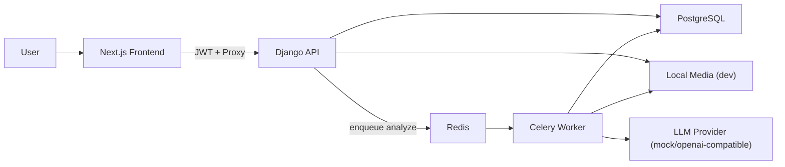
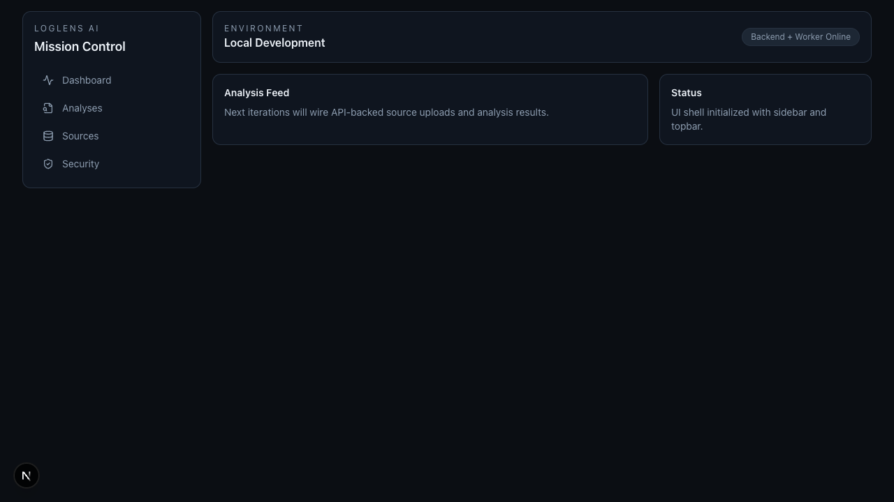
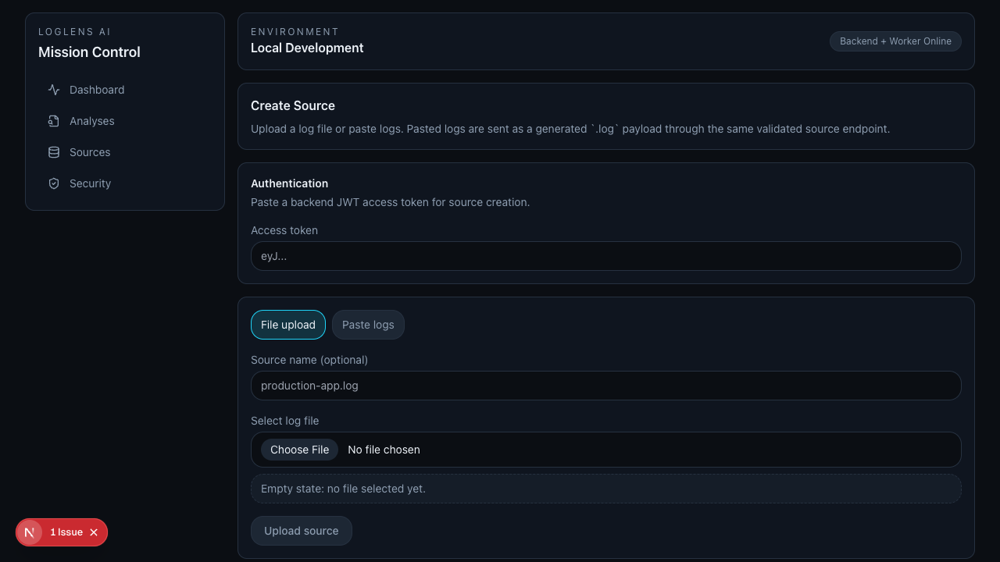
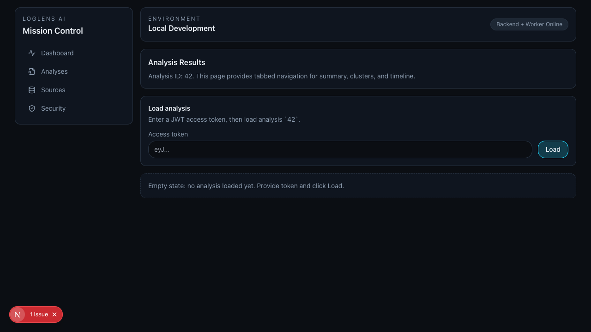

# LogLens AI (AI Log Analyzer)

LogLens AI ingests application logs, normalizes and clusters events, runs guarded AI analysis, and produces incident-ready exports.

## Architecture


## Core Features
- Authenticated upload pipeline for `.log/.txt/.jsonl/.gz`
- Celery-based analysis orchestration and status polling
- Parsing + normalization for JSON/text/nginx logs
- Error clustering and timeline/spike visualization
- Guarded AI insights (summary, hypotheses, remediation)
- Export endpoints for JSON and Markdown reports
- Hardening controls: analyze rate limiting, retention cleanup config, audit log events

## Local Run
```bash
docker compose up -d --build
```

Services:
- Frontend: `http://localhost:3100`
- Backend: `http://localhost:8000`

## Local Testing
- Full local validation steps: [`docs/local-testing.md`](docs/local-testing.md)

## Screenshots
### Dashboard


### Source Ingestion


### Analysis Results


## Notes
- MVP UI runs in dark mode by design.
- Frontend uses same-origin proxy routes for backend access.
- Worker tasks are queued on DB commit for retry-safe orchestration.

## Demo Walkthrough
- 2-3 minute script: [`markdowns/demo_script.md`](markdowns/demo_script.md)
